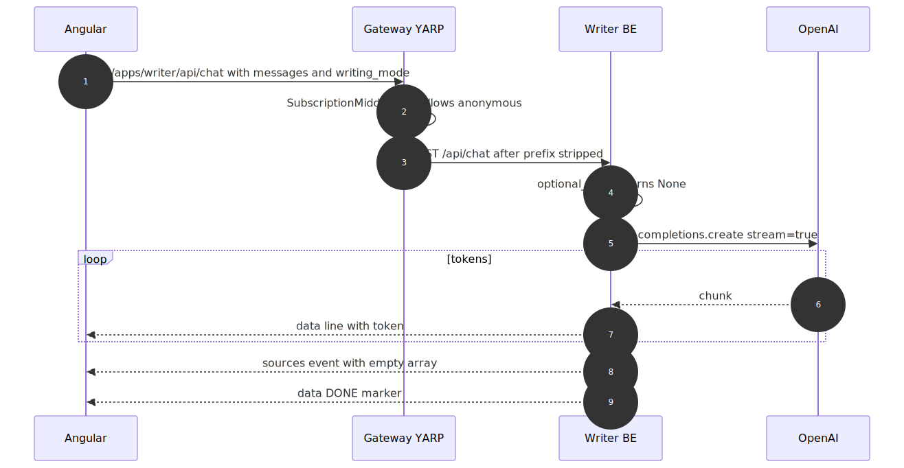
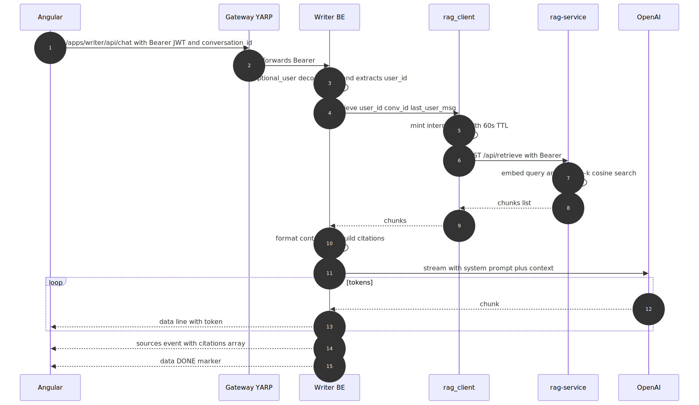
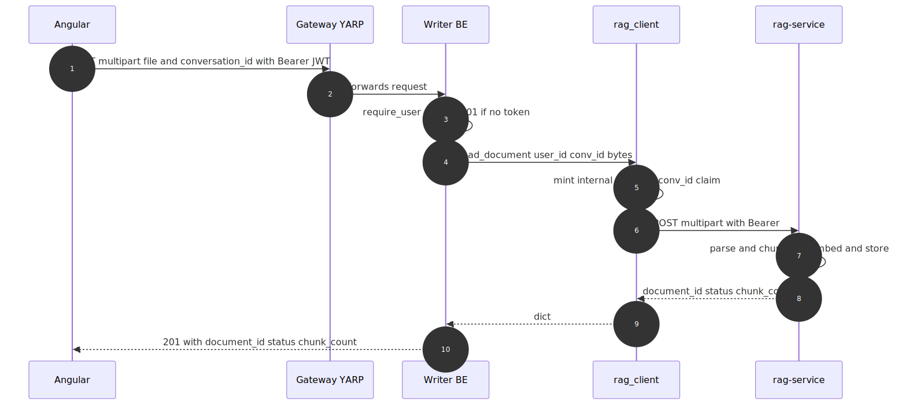
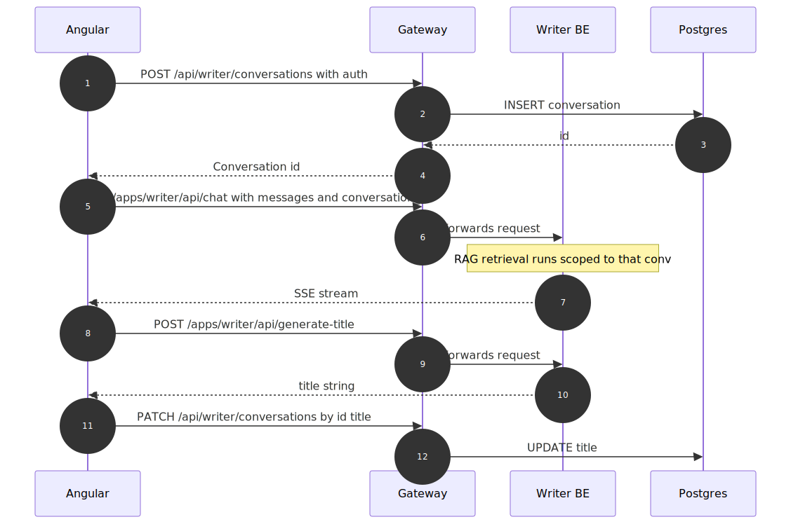

# ai-writing-assistant — Architecture, Flow & Decisions (EN)

> **Status:** Phase 5 (RAG integration) complete and end-to-end verified.
> See `MIMARI-VE-KARARLAR-TR.md` for the Turkish version.

---

## 1. What this app is

The **AI Writing Assistant** is a multi-mode writing tool (general,
blog, email, report, creative) that streams answers token-by-token,
remembers conversations, and — when authenticated — grounds answers
in the user's uploaded documents via the central `rag-service`.

It is split across **four** processes that each own one thing:

1. **Angular frontend** — chat UI, conversation sidebar, document tray.
2. **.NET Gateway** — front door: auth, subscription gating, owns
   conversation persistence, proxies AI calls through YARP.
3. **Writer FastAPI backend** — stateless: prompts OpenAI for chat +
   title generation, proxies document calls to rag-service.
4. **rag-service** — central RAG infrastructure (separate repo /
   service; this app is one of its tenants).

It deliberately does **not**:

- store conversations in the Python backend (Gateway owns that),
- store documents in the Python backend (rag-service owns that),
- expose rag-service directly to the browser (only the BE has the
  internal JWT secret).

---

## 2. High-level architecture



**Port reference:** Angular `4201`, Gateway `5000`, Writer BE `8001`,
rag-service `8100`.

---

## 3. Step-by-step request flows

### 3.1 Plain chat — `POST /api/chat` (anonymous OR authed without conversation_id)

This is the simplest path. No DB, no RAG. The browser may send no
token at all and the chat still works.



### 3.2 RAG-aware chat — `POST /api/chat` with auth + conversation_id

The headline Phase 5 flow. Retrieval runs **before** the LLM stream
opens, so citations can be emitted in the same SSE channel as the
answer.



**Hallucination guard:** the system message tells the model "if the
excerpts don't contain the answer, say so". When `chunks=[]`, no
context is injected and `event: sources` carries an empty array so
the FE clears any stale citations.

### 3.3 Document upload — `POST /api/documents`

A pure proxy. The Writer BE never reads file bytes back from disk;
rag-service owns storage.



`GET /api/documents` and `DELETE /api/documents/{id}` follow the same
pattern.

### 3.4 New conversation + first message

Conversation persistence lives in the **Gateway**, not in the Python
backend. The FE flow:



---

## 4. The two-JWT model

Two completely separate JWT systems are in play, and confusing them
is the #1 source of bugs.

| Token            | Issued by                              | Verified by                           | Lifetime | Carries                            |
| ---------------- | -------------------------------------- | ------------------------------------- | -------- | ---------------------------------- |
| **Gateway JWT**  | `Gateway/AuthService.cs` (login)       | Gateway middleware AND `auth.py` (BE) | hours    | `nameid`, `email`                  |
| **Internal JWT** | `rag_client._mint_token` (per request) | `rag-service/auth.py`                 | 60 s     | `sub`, `app_id`, `conversation_id` |

| Property                | Gateway JWT                       | Internal JWT                                        |
| ----------------------- | --------------------------------- | --------------------------------------------------- |
| Audience                | end-user browser                  | rag-service only                                    |
| Algorithm + secret      | HS256, `GATEWAY_JWT_SECRET`       | HS256, `RAG_INTERNAL_JWT_SECRET` (different secret) |
| Issuer / audience claim | `Gateway.API` / `Gateway.Clients` | `level-2-writer` / —                                |
| Reaches the network     | yes — sent by browser             | no — never leaves the BE → rag-service hop          |
| Rotation impact         | logs every user out               | re-mints next request                               |

The Writer BE is the **only** place that sees both. End users never
hold an internal JWT; rag-service never sees a Gateway JWT.

---

## 5. Data ownership

| Data                   | Owner       | Storage                                        |
| ---------------------- | ----------- | ---------------------------------------------- |
| Users + login          | Gateway     | Postgres (EF Core)                             |
| Conversations + titles | Gateway     | Postgres (EF Core)                             |
| Subscription / quota   | Gateway     | Postgres (EF Core)                             |
| Live chat messages     | **nobody**  | Streamed via SSE, ephemeral in BE memory       |
| Documents + chunks     | rag-service | Neon Postgres `rag_level2_writer` schema       |
| Document blobs         | rag-service | Local FS at `storage/level2_writer/<user>/...` |
| Embeddings             | rag-service | pgvector column in `chunks` table              |
| OpenAI prompt strategy | Writer BE   | `writer.py` constants                          |
| OpenAI billing         | Writer BE   | Its own API key                                |

The Python backend is **stateless by design**. Restart it any time —
nothing is lost.

---

## 6. Key design decisions

| Decision                                            | Rationale                                                                                                                                                  |
| --------------------------------------------------- | ---------------------------------------------------------------------------------------------------------------------------------------------------------- |
| **Stateless Python BE**                             | Gateway already owns auth + persistence; duplicating it in Python doubles the failure surface. Restarts are free.                                          |
| **SSE not WebSocket**                               | Chat is one-way (server→client). SSE rides plain HTTP, plays nicely with YARP, is trivial to test with `curl`.                                             |
| **Optional auth on `/api/chat`**                    | Local dev without Gateway must still work. RAG is the bonus when authed; the core writing assistant degrades gracefully to anonymous.                      |
| **Required auth on `/api/documents`**               | Documents are personal data; no anon path makes sense.                                                                                                     |
| **Retrieve before streaming**                       | If retrieval was interleaved with token streaming, citations would arrive after the answer mid-render. Up-front lets us emit `event: sources` cleanly.     |
| **Citations on the same SSE channel**               | One round-trip, FE bookkeeping stays simple. The `event: sources` line is standard SSE — any client library handles it.                                    |
| **Empty `event: sources` always emitted**           | Lets the FE clear stale citation chips from previous turns without an extra "clear" message.                                                               |
| **`max_distance = 0.6`**                            | rag-service default `0.4` is too strict for `text-embedding-3-small` — even tightly relevant chunks score 0.30–0.45. 0.6 keeps recall, blocks > 0.7 noise. |
| **`k = 4` chunks**                                  | Sweet spot: enough context for multi-fact questions, small enough to leave room for chat history within gpt-4o-mini's window.                              |
| **`_SOURCE_PREVIEW_CHARS = 200`**                   | Citation preview is for a tooltip / chip, not full content. Keeps the SSE event payload small.                                                             |
| **Per-request internal JWT (60 s TTL)**             | No token cache to invalidate; replay window is minimal; rotation is just a restart.                                                                        |
| **`app_id = level-2-writer`**                       | rag-service maps this to the `rag_level2_writer` schema. The string is a constant, not user input — never accept it from a request body.                   |
| **`writer.py` accepts `rag_context: str \| None`**  | Keeps backward compatibility for callers that don't use RAG. The anti-hallucination prompt is built into `writer.py`, not the route handler.               |
| **`Annotated[Type, Depends(...)]` parameter style** | The modern FastAPI style — composes with `response_class`/`status_code` cleanly and lets Pydantic understand the parameter as injection, not body.         |

---

## 7. Module map (`backend/`)

| File               | Responsibility                                                                                                                               |
| ------------------ | -------------------------------------------------------------------------------------------------------------------------------------------- |
| `main.py`          | FastAPI app, lifespan (rag_client startup/shutdown), CORS, all routes.                                                                       |
| `config.py`        | Plain `os.getenv` settings + `rag_enabled()` flag.                                                                                           |
| `auth.py`          | Gateway JWT decoder. `GatewayUser` model + `require_user` / `optional_user` dependencies. Checks `nameidentifier`, `nameid`, `sub` in order. |
| `rag_client.py`    | Async `httpx.AsyncClient` to rag-service. `RagClient.startup/shutdown` for lifespan. `_mint_token` for per-request internal JWT.             |
| `writer.py`        | OpenAI `AsyncOpenAI` client + `WRITING_PROMPTS` dict + `stream_chat(rag_context=None)` + `generate_title`.                                   |
| `models.py`        | Pydantic DTOs: `ChatRequest`, `GenerateTitle*`, `DocumentUploadResponse`, `DocumentItem`, `DocumentListResponse`, `SourceCitation`.          |
| `requirements.txt` | FastAPI / uvicorn / openai / pydantic / python-dotenv + PyJWT / httpx / python-multipart (Phase 5).                                          |

---

## 8. Public HTTP contract

All Phase-5 auth-required endpoints require a Bearer Gateway JWT.

| Endpoint                       | Verb   | Auth         | Body / Form / Query                               | Returns                                                   |
| ------------------------------ | ------ | ------------ | ------------------------------------------------- | --------------------------------------------------------- |
| `/api/health`                  | GET    | none         | —                                                 | `{status, service}`                                       |
| `/api/chat`                    | POST   | optional     | `{messages, writing_mode, conversation_id?}`      | `text/event-stream`: tokens + `event: sources` + `[DONE]` |
| `/api/generate-title`          | POST   | none         | `{messages, current_title}`                       | `{title, new_score, old_score}`                           |
| `/api/documents`               | POST   | **required** | multipart `file`, optional `conversation_id` form | `201 {document_id, status, chunk_count}`                  |
| `/api/documents`               | GET    | **required** | optional `?conversation_id=`                      | `{documents: [DocumentItem]}`                             |
| `/api/documents/{document_id}` | DELETE | **required** | —                                                 | `204` empty                                               |

SSE event payload for `event: sources`:

```json
[
  {
    "document_id": "uuid",
    "document_filename": "mercury.txt",
    "chunk_index": 0,
    "distance": 0.4085,
    "preview": "first 200 chars of the chunk..."
  }
]
```

---

## 9. Configuration (`.env`)

| Variable                  | Required             | Notes                                                  |
| ------------------------- | -------------------- | ------------------------------------------------------ |
| `OPENAI_API_KEY`          | yes                  | Without it, `/api/chat` returns 500                    |
| `OPENAI_MODEL`            | optional             | Defaults to `gpt-4o-mini`                              |
| `GATEWAY_JWT_SECRET`      | yes for RAG features | Must match Gateway's `Jwt:Secret`                      |
| `GATEWAY_JWT_ISSUER`      | optional             | Defaults to `Gateway.API`                              |
| `GATEWAY_JWT_AUDIENCE`    | optional             | Defaults to `Gateway.Clients`                          |
| `RAG_SERVICE_URL`         | yes for RAG features | Defaults to `http://localhost:8100`                    |
| `RAG_INTERNAL_JWT_SECRET` | yes for RAG features | Must match rag-service's `INTERNAL_JWT_SECRET`         |
| `RAG_APP_ID`              | optional             | Defaults to `level-2-writer` (maps to schema `level2`) |

When either `GATEWAY_JWT_SECRET` or `RAG_INTERNAL_JWT_SECRET` is empty:

- `/api/chat` keeps working in anonymous mode (no RAG injection),
- `/api/documents` endpoints return `503 Service Unavailable`.

---

## 10. Things to know later

- **`statement_cache_size=0` on the Gateway DB:** when Gateway uses
  the Neon pooler, EF Core's prepared statements must be disabled.
  This is a Gateway concern, not the Writer BE's, but a common
  copy-paste mistake when adding new app schemas.
- **CORS list:** every new prod origin must be added to `main.py`'s
  `allow_origins`. Wildcards do not work because `allow_credentials=True`.
- **`x-accel-buffering: no`:** required if you ever stick nginx in
  front of the BE. YARP already passes SSE through unbuffered.
- **OpenAI cost shape:** RAG calls add 1 embedding round-trip per
  chat turn (cheap), plus extra prompt tokens for the injected context
  (capped by `k * chunk_size`). Budget accordingly when tuning `_RAG_K`.
- **gpt-4o-mini context window:** 128k. With `k=4` chunks of ~500
  tokens each, RAG eats ~2k tokens, leaving plenty for chat history.
- **Internal JWT rotation:** rotating `RAG_INTERNAL_JWT_SECRET` needs
  a restart of every consuming backend (Writer, future Chatbot, etc.)
  and rag-service. There's no overlap window today.
- **Conversation deletion does NOT delete RAG documents.** They are
  scoped to `conversation_id` but live in rag-service. A future cleanup
  hook in the Gateway can fan out `DELETE /api/documents` calls.
- **Adding a new writing mode:** add a key to `WRITING_PROMPTS` in
  `writer.py` and the Angular dropdown — no other change needed.

---

## 11. What was verified (Phase 5 exit gate)

End-to-end smoke test (in-process ASGI client + live rag-service):

| Case                                          | Result                                                     |
| --------------------------------------------- | ---------------------------------------------------------- |
| `GET /api/documents` without auth             | 401                                                        |
| Upload `mercury.txt` (auth + conversation_id) | 201, `status=ready`, 1 chunk                               |
| `GET /api/documents?conversation_id=...`      | 200, the upload listed                                     |
| Chat HIT: "What is the diameter of Mercury?"  | Stream + `event: sources` with cited file, distance 0.4085 |
| Chat MISS: "PostgreSQL pooling tips?"         | Stream + `event: sources: []`                              |
| Anonymous chat (no token)                     | Stream OK, no sources event                                |
| `DELETE /api/documents/{id}`                  | 204                                                        |

The bug that surfaced: rag-service's default `max_distance=0.4` was
too tight against `text-embedding-3-small`. We empirically found
0.4085 for a paragraph that literally answers the question. Threshold
relaxed to 0.6 in `_RAG_MAX_DISTANCE`.

---

## 12. Commit milestones

| Phase | Description                                                                                                     |
| ----- | --------------------------------------------------------------------------------------------------------------- |
| 0–4   | Original Week-2 writing assistant (SSE chat + title gen)                                                        |
| 5     | RAG integration: Gateway JWT decode, rag_client, document proxy endpoints, RAG-aware chat with `event: sources` |
| 6     | (planned) FE: 📎 button, document chips, "Sources" accordion                                                    |
| 7     | (planned) End-to-end test through Gateway, bug fixes, push                                                      |
