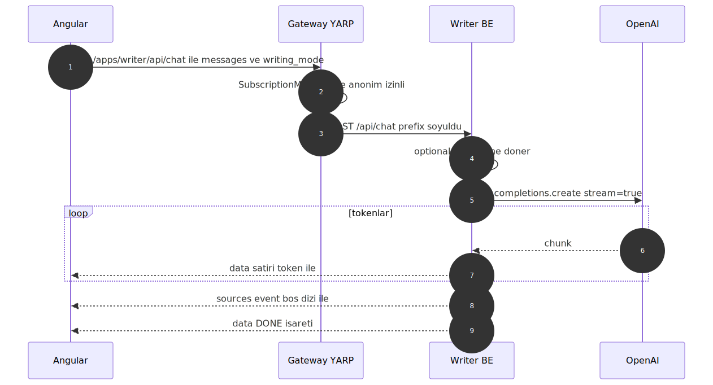
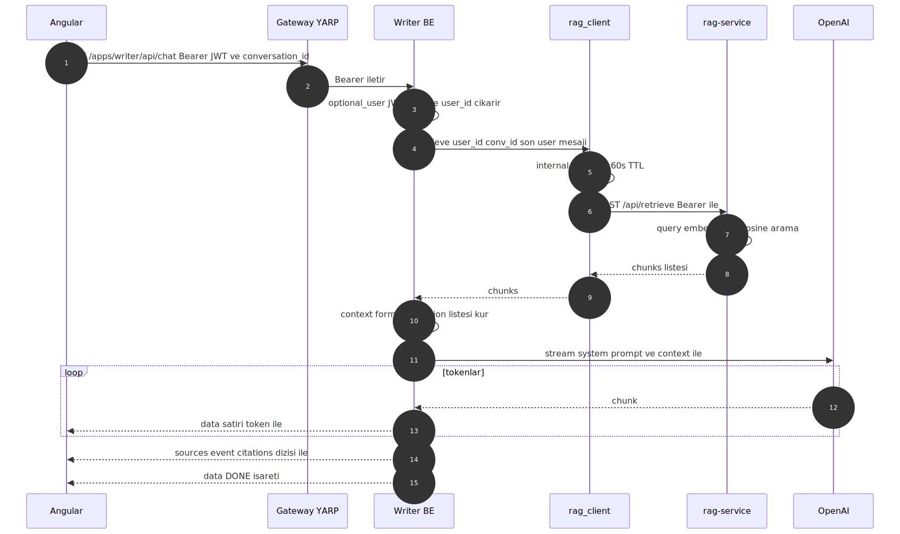
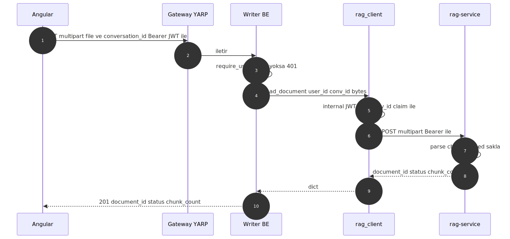
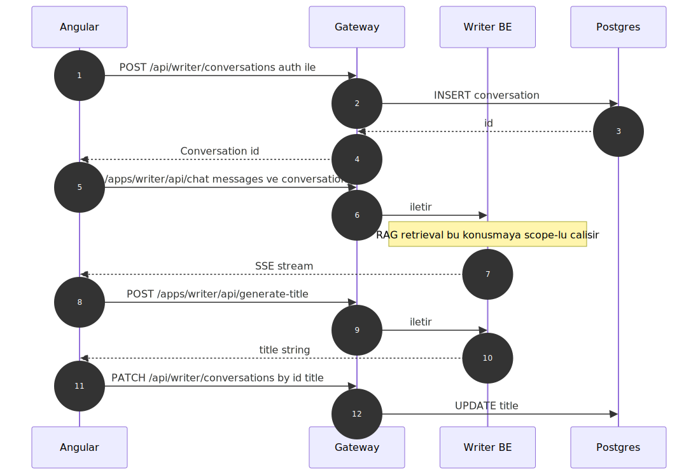

# ai-writing-assistant — Mimari, Akış ve Kararlar (TR)

> **Durum:** Faz 5 (RAG entegrasyonu) tamamlandı ve uçtan uca doğrulandı.
> İngilizce sürümü için: `ARCHITECTURE-AND-DECISIONS-EN.md`.

---

## 1. Bu uygulama nedir?

**AI Writing Assistant**, çok modlu (general, blog, email, report,
creative) bir yazım asistanıdır. Cevapları token-by-token akıtır,
konuşmaları hatırlar ve — kullanıcı kimlik doğrulamasından geçtiyse —
merkezi `rag-service` üzerinden kullanıcının yüklediği dokümanlara
dayanarak cevap üretir.

Sistem her biri tek bir iş yapan **dört** sürece bölünmüştür:

1. **Angular frontend** — sohbet arayüzü, konuşma menüsü, doküman kutusu.
2. **.NET Gateway** — ön kapı: auth, abonelik kontrolü, konuşma
   kalıcılığı, YARP üzerinden AI çağrılarının proxy'lenmesi.
3. **Writer FastAPI backend** — stateless: OpenAI'a chat + başlık
   üretimi için prompt gönderir, doküman çağrılarını rag-service'e
   proxy'ler.
4. **rag-service** — merkezi RAG altyapısı (ayrı repo / servis; bu
   uygulama onun kiracılarından biri).

Bilinçli olarak **yapmadığı** şeyler:

- Python backend'de konuşma saklamak (bunu Gateway sahiplenir),
- Python backend'de doküman saklamak (bunu rag-service sahiplenir),
- rag-service'i tarayıcıya doğrudan açmak (internal JWT secret sadece
  BE'de).

---

## 2. Üst seviye mimari



**Port referansı:** Angular `4201`, Gateway `5000`, Writer BE `8001`,
rag-service `8100`.

---

## 3. Adım adım istek akışları

### 3.1 Düz sohbet — `POST /api/chat` (anonim VEYA conversation_id'siz authed)

En sade yol. DB yok, RAG yok. Tarayıcı hiç token göndermeden de
chat çalışmaya devam eder.



### 3.2 RAG'lı sohbet — `POST /api/chat` (auth + conversation_id ile)

Faz 5'in başrol akışı. Retrieval, LLM stream'i açılmadan **önce**
çalışır; böylece atıflar cevapla aynı SSE kanalından gönderilebiliyor.



**Halüsinasyon koruması:** system mesajı modele "alıntılar cevabı
içermiyorsa söyle, uyduruyor" der. `chunks=[]` durumunda context
enjekte edilmez ve `event: sources` boş dizi ile gönderilir — FE
önceki turdan kalan atıfları böylece temizler.

### 3.3 Doküman yükleme — `POST /api/documents`

Saf bir proxy. Writer BE diskten dosya byte'larını asla geri okumaz;
saklama rag-service'in işidir.



`GET /api/documents` ve `DELETE /api/documents/{id}` aynı kalıbı izler.

### 3.4 Yeni konuşma + ilk mesaj

Konuşma kalıcılığı Python backend'de değil, **Gateway**'de yaşar.
FE akışı:



---

## 4. İki-JWT modeli

Tamamen ayrı iki JWT sistemi devrede. Bunları karıştırmak en sık
yapılan hata.

| Token            | Üretici                              | Doğrulayan                            | Ömür    | Taşıdığı claim'ler                 |
| ---------------- | ------------------------------------ | ------------------------------------- | ------- | ---------------------------------- |
| **Gateway JWT**  | `Gateway/AuthService.cs` (login)     | Gateway middleware + Writer `auth.py` | saatler | `nameid`, `email`                  |
| **Internal JWT** | `rag_client._mint_token` (her istek) | `rag-service/auth.py`                 | 60 sn   | `sub`, `app_id`, `conversation_id` |

| Özellik            | Gateway JWT                       | Internal JWT                                     |
| ------------------ | --------------------------------- | ------------------------------------------------ |
| Hedef kitle        | son kullanıcı tarayıcısı          | yalnız rag-service                               |
| Algoritma + secret | HS256, `GATEWAY_JWT_SECRET`       | HS256, `RAG_INTERNAL_JWT_SECRET` (farklı secret) |
| Issuer / audience  | `Gateway.API` / `Gateway.Clients` | `level-2-writer` / —                             |
| Ağda gezer mi      | evet — tarayıcı gönderir          | hayır — sadece BE → rag-service segmentinde      |
| Rotasyon etkisi    | tüm kullanıcılar çıkış yapar      | bir sonraki istekte yeniden üretilir             |

Writer BE her ikisini de gören **tek** yer. Son kullanıcı internal
JWT'ye hiç dokunmaz; rag-service Gateway JWT'sini hiç görmez.

---

## 5. Veri sahipliği

| Veri                     | Sahibi        | Saklama                                     |
| ------------------------ | ------------- | ------------------------------------------- |
| Kullanıcı + login        | Gateway       | Postgres (EF Core)                          |
| Konuşmalar + başlıklar   | Gateway       | Postgres (EF Core)                          |
| Abonelik / quota         | Gateway       | Postgres (EF Core)                          |
| Canlı sohbet mesajları   | **hiç kimse** | SSE ile akar, BE belleğinde geçici          |
| Dokümanlar + chunks      | rag-service   | Neon Postgres `rag_level2_writer` şeması    |
| Doküman blob'ları        | rag-service   | Local FS `storage/level2_writer/<user>/...` |
| Embeddings               | rag-service   | `chunks` tablosundaki pgvector kolonu       |
| OpenAI prompt stratejisi | Writer BE     | `writer.py` constants                       |
| OpenAI faturalama        | Writer BE     | Kendi API key'i                             |

Python backend **tasarım gereği stateless**. Ne zaman istersen restart
et — hiçbir şey kaybolmaz.

---

## 6. Önemli tasarım kararları

| Karar                                               | Gerekçe                                                                                                                                                                       |
| --------------------------------------------------- | ----------------------------------------------------------------------------------------------------------------------------------------------------------------------------- |
| **Stateless Python BE**                             | Gateway zaten auth + persistence sahibi; Python'da çoğaltmak hata yüzeyini iki katına çıkarır. Restart bedavadır.                                                             |
| **WebSocket değil SSE**                             | Chat tek yönlü (server→client). SSE düz HTTP üzerinde gider, YARP ile sorunsuz çalışır, `curl` ile test edilmesi triviyal.                                                    |
| **`/api/chat`'te opsiyonel auth**                   | Gateway olmadan local dev'in çalışması şart. RAG kimlik doğrulamada bonus; çekirdek yazım asistanı anonim moda zarif düşer.                                                   |
| **`/api/documents`'te zorunlu auth**                | Dokümanlar kişisel veri; anonim yol mantıksız.                                                                                                                                |
| **Stream öncesi retrieval**                         | Retrieval token akışıyla iç içe olsaydı, atıflar cevabın yarısı render olduktan sonra gelecekti. Önden çekmek `event: sources`'u temiz yayımlatır.                            |
| **Atıflar aynı SSE kanalında**                      | Tek tur-trip, FE muhasebesi sade kalır. `event: sources` satırı standart SSE — her istemci kütüphanesi anlar.                                                                 |
| **Boş `event: sources` her durumda yayımlanır**     | FE'nin önceki turdan kalan atıf chip'lerini ekstra "clear" mesajı olmadan temizlemesini sağlar.                                                                               |
| **`max_distance = 0.6`**                            | rag-service default'u `0.4` `text-embedding-3-small` için fazla sıkı — gerçekten alakalı chunk'lar bile 0.30–0.45 skoru alır. 0.6 recall'ı korur, > 0.7 gürültüyü kesip atar. |
| **`k = 4` chunk**                                   | Tatlı nokta: çok-olgulu sorular için yeterli bağlam, gpt-4o-mini'nin penceresinde chat geçmişine yer bırakacak kadar az.                                                      |
| **`_SOURCE_PREVIEW_CHARS = 200`**                   | Citation preview tooltip / chip için, tam içerik için değil. SSE event payload'unu küçük tutar.                                                                               |
| **İstek başına internal JWT (60 sn TTL)**           | Geçersiz kılınacak token cache'i yok; replay penceresi minimal; rotasyon sadece bir restart.                                                                                  |
| **`app_id = level-2-writer`**                       | rag-service bunu `rag_level2_writer` şemasına eşler. Sabit bir string, kullanıcı girdisi değil — istek body'sinden asla kabul etme.                                           |
| **`writer.py` `rag_context: str \| None` alır**     | RAG kullanmayan çağrılar için geriye dönük uyumluluğu korur. Anti-halüsinasyon prompt'u `writer.py`'de, route handler'da değil.                                               |
| **`Annotated[Type, Depends(...)]` parametre tarzı** | Modern FastAPI stili — `response_class`/`status_code` ile temiz birleşir, Pydantic'in parametreyi body değil enjeksiyon olarak anlamasını sağlar.                             |

---

## 7. Modül haritası (`backend/`)

| Dosya              | Sorumluluk                                                                                                                                      |
| ------------------ | ----------------------------------------------------------------------------------------------------------------------------------------------- |
| `main.py`          | FastAPI app, lifespan (rag_client startup/shutdown), CORS, tüm route'lar.                                                                       |
| `config.py`        | Düz `os.getenv` ayarları + `rag_enabled()` flag'i.                                                                                              |
| `auth.py`          | Gateway JWT decoder. `GatewayUser` modeli + `require_user` / `optional_user` bağımlılıkları. `nameidentifier`, `nameid`, `sub`'ı sırayla dener. |
| `rag_client.py`    | rag-service'e async `httpx.AsyncClient`. Lifespan için `RagClient.startup/shutdown`. İstek başına internal JWT için `_mint_token`.              |
| `writer.py`        | OpenAI `AsyncOpenAI` istemcisi + `WRITING_PROMPTS` dict + `stream_chat(rag_context=None)` + `generate_title`.                                   |
| `models.py`        | Pydantic DTO'ları: `ChatRequest`, `GenerateTitle*`, `DocumentUploadResponse`, `DocumentItem`, `DocumentListResponse`, `SourceCitation`.         |
| `requirements.txt` | FastAPI / uvicorn / openai / pydantic / python-dotenv + PyJWT / httpx / python-multipart (Faz 5).                                               |

---

## 8. Public HTTP sözleşmesi

Faz 5'in tüm auth gerektiren endpoint'leri Bearer Gateway JWT ister.

| Endpoint                       | Verb   | Auth        | Body / Form / Query                                | Döner                                                        |
| ------------------------------ | ------ | ----------- | -------------------------------------------------- | ------------------------------------------------------------ |
| `/api/health`                  | GET    | yok         | —                                                  | `{status, service}`                                          |
| `/api/chat`                    | POST   | opsiyonel   | `{messages, writing_mode, conversation_id?}`       | `text/event-stream`: token'lar + `event: sources` + `[DONE]` |
| `/api/generate-title`          | POST   | yok         | `{messages, current_title}`                        | `{title, new_score, old_score}`                              |
| `/api/documents`               | POST   | **zorunlu** | multipart `file`, opsiyonel `conversation_id` form | `201 {document_id, status, chunk_count}`                     |
| `/api/documents`               | GET    | **zorunlu** | opsiyonel `?conversation_id=`                      | `{documents: [DocumentItem]}`                                |
| `/api/documents/{document_id}` | DELETE | **zorunlu** | —                                                  | `204` boş                                                    |

`event: sources` SSE event payload'u:

```json
[
  {
    "document_id": "uuid",
    "document_filename": "mercury.txt",
    "chunk_index": 0,
    "distance": 0.4085,
    "preview": "chunk'ın ilk 200 karakteri..."
  }
]
```

---

## 9. Konfigürasyon (`.env`)

| Değişken                  | Zorunlu       | Notlar                                                |
| ------------------------- | ------------- | ----------------------------------------------------- |
| `OPENAI_API_KEY`          | evet          | Olmadan `/api/chat` 500 döner                         |
| `OPENAI_MODEL`            | opsiyonel     | Default `gpt-4o-mini`                                 |
| `GATEWAY_JWT_SECRET`      | RAG için evet | Gateway'in `Jwt:Secret` değeriyle birebir aynı olmalı |
| `GATEWAY_JWT_ISSUER`      | opsiyonel     | Default `Gateway.API`                                 |
| `GATEWAY_JWT_AUDIENCE`    | opsiyonel     | Default `Gateway.Clients`                             |
| `RAG_SERVICE_URL`         | RAG için evet | Default `http://localhost:8100`                       |
| `RAG_INTERNAL_JWT_SECRET` | RAG için evet | rag-service `INTERNAL_JWT_SECRET` ile aynı olmalı     |
| `RAG_APP_ID`              | opsiyonel     | Default `level-2-writer` (`level2` şemasına eşlenir)  |

`GATEWAY_JWT_SECRET` veya `RAG_INTERNAL_JWT_SECRET` boş olduğunda:

- `/api/chat` anonim modda çalışmaya devam eder (RAG enjekte edilmez),
- `/api/documents` endpoint'leri `503 Service Unavailable` döner.

---

## 10. İleride bilinmesi gerekenler

- **Gateway DB'sinde `statement_cache_size=0`:** Gateway Neon pooler
  kullanıyorsa EF Core'un prepared statement'ları kapanmalı. Bu Writer
  BE'nin değil Gateway'in derdi, ama yeni app şemaları eklerken sık
  yapılan kopyala-yapıştır hatası.
- **CORS listesi:** Her yeni prod origin `main.py`'deki `allow_origins`'a
  eklenmeli. `allow_credentials=True` olduğu için wildcard çalışmaz.
- **`x-accel-buffering: no`:** BE'nin önüne nginx koyacaksan şart.
  YARP zaten SSE'yi buffer'lamadan geçiriyor.
- **OpenAI maliyet profili:** RAG çağrıları her chat turuna 1 embedding
  round-trip ekler (ucuz) + enjekte edilen context için fazladan
  prompt token (üst sınır `k * chunk_size`). `_RAG_K`'yı ayarlarken
  bütçeye dikkat.
- **gpt-4o-mini context penceresi:** 128k. `k=4` × ~500 token chunk'la
  RAG ~2k token yer; chat geçmişine bol yer kalır.
- **Internal JWT rotasyonu:** `RAG_INTERNAL_JWT_SECRET` değiştirilince
  tüm tüketici backend'leri (Writer, ileride Chatbot vb.) + rag-service
  restart ister. Şu an üst üste binme penceresi yok.
- **Konuşma silmek RAG dokümanlarını SİLMEZ.** Dokümanlar
  `conversation_id`'ye scope'lu ama rag-service'te yaşıyor. Gateway'e
  ileride eklenecek bir cleanup hook'u `DELETE /api/documents` çağrılarını
  fan-out edecek.
- **Yeni writing mode eklemek:** `writer.py`'deki `WRITING_PROMPTS`'a
  bir anahtar ekle + Angular dropdown'a ekle — başka değişiklik yok.

---

## 11. Doğrulanan senaryolar (Faz 5 çıkış kapısı)

Uçtan uca smoke test (in-process ASGI client + canlı rag-service):

| Senaryo                                        | Sonuç                                           |
| ---------------------------------------------- | ----------------------------------------------- |
| `GET /api/documents` auth'suz                  | 401                                             |
| `mercury.txt` yükleme (auth + conversation_id) | 201, `status=ready`, 1 chunk                    |
| `GET /api/documents?conversation_id=...`       | 200, yüklenen liste içinde                      |
| Chat HIT: "What is the diameter of Mercury?"   | Stream + atıflı `event: sources`, mesafe 0.4085 |
| Chat MISS: "PostgreSQL pooling tips?"          | Stream + `event: sources: []`                   |
| Anonim chat (token yok)                        | Stream çalışıyor, sources event'i yok           |
| `DELETE /api/documents/{id}`                   | 204                                             |

Yüzeye çıkan bug: rag-service'in default `max_distance=0.4` eşiği
`text-embedding-3-small`'da fazla sıkıydı. Sorunun cevabını birebir
veren bir paragraf için ampirik mesafe 0.4085 ölçüldü. Eşik
`_RAG_MAX_DISTANCE = 0.6`'ya gevşetildi.

---

## 12. Commit kilometre taşları

| Faz | Açıklama                                                                                                          |
| --- | ----------------------------------------------------------------------------------------------------------------- |
| 0–4 | Hafta-2 orijinal yazım asistanı (SSE chat + başlık üretimi)                                                       |
| 5   | RAG entegrasyonu: Gateway JWT decode, rag_client, doküman proxy endpoint'leri, `event: sources`'lu RAG-aware chat |
| 6   | (planlanan) FE: 📎 buton, doküman chip'leri, "Kaynaklar" accordion                                                |
| 7   | (planlanan) Gateway üzerinden uçtan uca test, bug fix, push                                                       |
