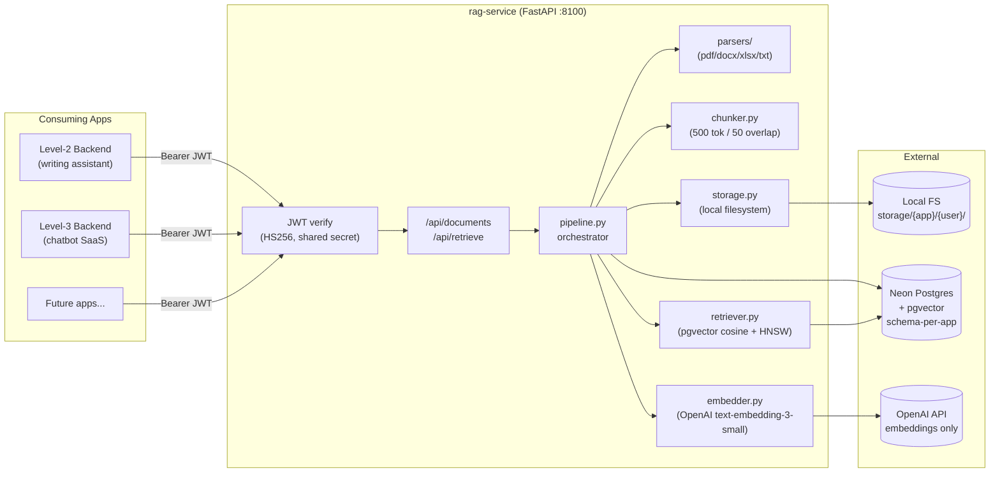
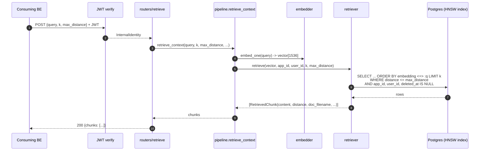
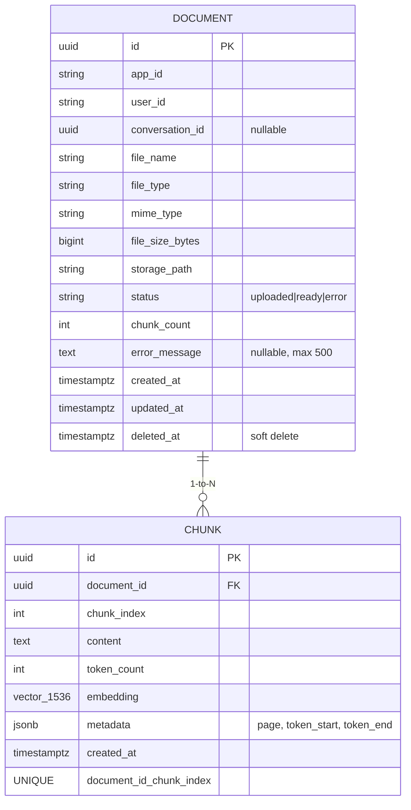

# rag-service — Architecture, Flow & Decisions (EN)

> **Status:** Phases 0–4 complete. Service is feature-complete and
> end-to-end verified in-process. Not yet integrated with Level-2 BE.
> See `MIMARI-VE-KARARLAR-TR.md` for the Turkish version.

---

## 1. What this service is

`rag-service` is a **standalone FastAPI microservice** that owns every
piece of Retrieval-Augmented Generation infrastructure for the whole
SaaS portfolio (Level-2 writing assistant, Level-3 chatbot, future apps).

It does **four** things and intentionally nothing else:

1. **Ingest** user-uploaded documents (PDF / DOCX / XLSX / TXT).
2. **Index** them as vector embeddings in PostgreSQL + pgvector.
3. **Retrieve** the top-k most relevant chunks for a query.
4. **Isolate** tenants so app A can never see app B's data.

It deliberately does **not**:

- call an LLM (each consuming app owns its own LLM key + prompt),
- store conversations,
- do auth from end users (only trusts other backend services via JWT).

---

## 2. High-level architecture



---

## 3. Step-by-step request flows

### 3.1 Upload + ingest — `POST /api/documents`

```mermaid
sequenceDiagram
    autonumber
    participant App as Consuming BE
    participant Auth as auth.verify_internal_jwt
    participant R as routers/documents.upload
    participant P as pipeline.ingest_document
    participant S as storage.LocalStorage
    participant DB as Postgres (schema)
    participant Par as parsers/*
    participant Ch as chunker
    participant Em as embedder
    participant OAI as OpenAI

    App->>Auth: POST multipart + Bearer JWT
    Auth-->>R: InternalIdentity(app_id, user_id, conv_id?)
    R->>P: ingest_document(content, filename, mime, ...)
    P->>S: save(content) -> path
    P->>DB: INSERT document (status='uploaded') + COMMIT
    P->>Par: parse(content, mime) -> ParsedDocument
    P->>Ch: chunk_pages(parsed) -> [Chunk]
    P->>Em: embed_batch([texts]) -> [vectors]
    Em->>OAI: POST /v1/embeddings (batch=100)
    OAI-->>Em: [1536-d vectors]
    P->>DB: bulk INSERT chunks + UPDATE doc.status='ready' + COMMIT
    P-->>R: document_id
    R->>DB: re-read doc for chunk_count
    R-->>App: 201 {document_id, status, chunk_count}
```

**On failure** (parse / embed / DB write): document row is updated to
`status='error'` with a truncated `error_message`, exception re-raised
so the HTTP layer returns 500.

### 3.2 Semantic retrieval — `POST /api/retrieve`



**Hallucination guard:** when no chunk meets `max_distance` (default
`0.4`), the response is `{chunks: []}`. The consuming app then knows
it must refuse to answer instead of fabricating one.

---

## 4. Multi-tenant isolation model

Three layers, all enforced server-side:

| Layer | Mechanism |
|------|-----------|
| App-level | Separate Postgres **schema** per app: `rag_level2_writer`, `rag_level3_chatbot`, ... Same table shapes, different schemas. |
| User-level | Every row has `app_id` + `user_id` columns; every query filters by both. |
| Conversation-level (optional) | Documents can be scoped to a `conversation_id` UUID. Useful when the same user has multiple chats. |

A consuming backend **cannot** set its own `app_id`/`user_id` — both
come from the JWT it minted (and the secret is shared internally,
never exposed to end users).

---

## 5. Data model (per app schema)



Plus the cross-schema `rag_shared.embedding_cache` (deduplicates
identical chunks across apps to cut OpenAI cost — populated later).

**Indexes:**

- `documents (app_id, user_id, deleted_at)` — list query
- `documents (conversation_id)` — conversation scope
- `chunks (document_id)` — cascade lookup
- `chunks` **HNSW** on `embedding vector_cosine_ops` — `m=16,
  ef_construction=64` — the actual search index

---

## 6. Key design decisions

| Decision | Rationale |
|----------|-----------|
| **Microservice, not library** | Each app stays in its own stack (Angular+.NET / Python / Node); rag-service is a versionable HTTP contract. |
| **Schema-per-app** (not row-level multi-tenancy) | Cheaper migrations, hard isolation, can backup/restore one tenant. |
| **rag-service does NOT call the LLM** | Each app owns its prompt strategy, model choice, and OpenAI billing. Only embeddings are centralized. |
| **HS256 + shared secret** (not OAuth) | Service-to-service only. Internal network. Simple to rotate. JWT carries `app_id` + `user_id` + optional `conversation_id`. |
| **Local filesystem for blobs** (Phase 1) | Simpler than S3 for now. `StorageBackend` is a Protocol, so swapping to S3/Azure Blob is a 1-class change. |
| **tiktoken `cl100k_base` chunker, 500/50** | Matches OpenAI tokenizer used by `text-embedding-3-small`. 500 tokens ≈ 2-3 paragraphs — small enough to be precise, large enough for context. |
| **Cosine distance + max 0.4** | Empirically separates "actually relevant" from "vaguely related" for `text-embedding-3-small`. The hallucination guard. |
| **HNSW (not IVFFlat)** | Better recall/latency tradeoff at small-to-medium scale, no `LISTS` tuning. |
| **Soft delete** (`deleted_at`) | Old citations in past conversations still resolve to a filename; retrieval simply skips them. |
| **Connection: Neon pooler + `statement_cache_size=0`** | PgBouncer transaction mode breaks asyncpg's prepared statement cache. Mandatory setting. |

---

## 7. Module map (`rag_service/`)

| File | Responsibility |
|------|---------------|
| `main.py` | FastAPI app, lifespan (DB ping at boot), CORS, router mounting, `/api/health/{,live,ready}`. |
| `config.py` | Pydantic-settings: `DATABASE_URL`, `OPENAI_API_KEY`, `INTERNAL_JWT_SECRET`, `CORS_ORIGINS`. Singleton via `@lru_cache`. |
| `db.py` | Async SQLAlchemy engine + `session_factory`. `ping_db()` for readiness. `dispose_engine()` on shutdown. |
| `auth.py` | JWT verification (`InternalIdentity` model + `AuthedIdentity` FastAPI dependency). |
| `storage.py` | `StorageBackend` Protocol + `LocalStorageBackend`. Path-traversal guard. Layout: `{root}/{app_id}/{user_id}/{uuid}-{name}`. |
| `parsers/` | MIME dispatcher → `pdf_parser`, `docx_parser`, `xlsx_parser`, `txt_parser`. Common `ParsedDocument`/`ParsedPage` dataclasses. |
| `chunker.py` | `tiktoken` sliding-window splitter. Defaults: 500 tok / 50 overlap / min 20. |
| `embedder.py` | `AsyncOpenAI` singleton, `embed_one`, `embed_batch` (size 100, 3 retries, 30 s timeout). |
| `retriever.py` | Top-k vector search with `embedding.cosine_distance(:q)` reused in WHERE + ORDER BY. |
| `pipeline.py` | Orchestrator: `ingest_document()` + `retrieve_context()`. Also `schema_for_app()` + `_APP_TO_SCHEMA` map. |
| `schemas.py` | Pydantic request/response models. |
| `routers/documents.py` | `POST /api/documents`, `GET /api/documents`, `DELETE /api/documents/{id}`. |
| `routers/retrieve.py` | `POST /api/retrieve`. |
| `models/level2.py`, `models/level3.py` | SQLAlchemy ORM tables per schema. |
| `alembic/` | Schema-aware migrations: same migration runs once per schema with `MetaData(schema=...)`. |

---

## 8. Public HTTP contract

All endpoints require `Authorization: Bearer <HS256-JWT>` with these
claims:

| Claim | Required | Notes |
|-------|----------|-------|
| `sub` | yes | becomes `user_id` |
| `app_id` | yes | maps via `_APP_TO_SCHEMA` |
| `exp` | yes | short TTL (e.g. 5 min) |
| `iat` | recommended | |
| `conversation_id` | no | UUID, scopes documents to one chat |

| Endpoint | Verb | Status | Body / Query | Returns |
|----------|------|--------|--------------|---------|
| `/api/health/live` | GET | 200 | — | `{status:"alive",...}` |
| `/api/health/ready` | GET | 200 / 503 | — | DB reachability |
| `/api/documents` | POST | 201 / 401 / 415 | multipart `file`, optional `conversation_id` form | `{document_id, status, chunk_count}` |
| `/api/documents` | GET | 200 / 401 | optional `?conversation_id=` | `{documents: [...]}` |
| `/api/documents/{id}` | DELETE | 204 / 401 / 404 | — | empty body |
| `/api/retrieve` | POST | 200 / 401 | `{query, k=4, max_distance=0.4}` | `{chunks: [...]}` |

Error model: `{"detail": "..."}` (FastAPI default).

---

## 9. Things to know later

- **Embedding cost:** ~$0.02 per 1M tokens with `text-embedding-3-small`.
  Batch size 100 keeps round-trip cost low. The shared cache (later
  phase) will dedupe across apps.
- **HNSW after bulk insert:** for big imports, drop & rebuild the
  index for ~3× faster ingest, then reindex.
- **`max_distance` tuning:** if you change embedding model, the
  distance scale changes too. Re-tune empirically.
- **Schema rotation:** adding a new app = create schema + run Alembic
  with `target_schema=<new>` env var + add to `_APP_TO_SCHEMA`.
- **Secret rotation:** all backends share `INTERNAL_JWT_SECRET`.
  Rotate everywhere at once (or support overlap window).
- **Storage backend swap:** implement `StorageBackend` Protocol for
  S3 / Azure Blob; the rest of the pipeline stays the same.
- **Neon pooler quirks:** `statement_cache_size=0` is non-negotiable
  with asyncpg + PgBouncer transaction mode. If you remove it, every
  query randomly fails with "prepared statement does not exist".

---

## 10. What was verified

End-to-end ASGI smoke test (Phase 4 exit gate):

| Case | Result |
|------|--------|
| Missing `Authorization` header | 401 |
| Bad JWT signature | 401 |
| Upload 800-byte `.txt` | 201, `status=ready`, 1 chunk |
| List own docs | 200, contains the upload |
| Retrieve HIT ("What is the capital of Germany?") | 200, 1 chunk, distance 0.3689 |
| Retrieve MISS ("PostgreSQL connection pooling tips") | 200, 0 chunks (guard works) |
| Soft delete | 204, follow-up list excludes it |

Plus the Phase 3 standalone test: 150-word text → chunked → embedded →
retrieved with semantically correct cosine distances on real OpenAI.

---

## 11. Commit history of this service

| Commit | Phase |
|--------|-------|
| `1d16153 / 6402a9a / f8d8738` | Phase 0 — FastAPI scaffold |
| `1801113` | Phase 1 — Neon DB connectivity |
| `fc0db82` | Phase 2 — Alembic + initial migration |
| `15fb818` | Phase 3.1 — storage + parsers |
| `475b483` | Phase 3.2 + 3.3 — chunker + embedder |
| `1c53ed7` | Phase 3.4 + 3.5 — retriever + pipeline |
| `eeee125` | chore — formatter touches |
| `6ee5ec7` | **Phase 4 — JWT-protected REST API** |
