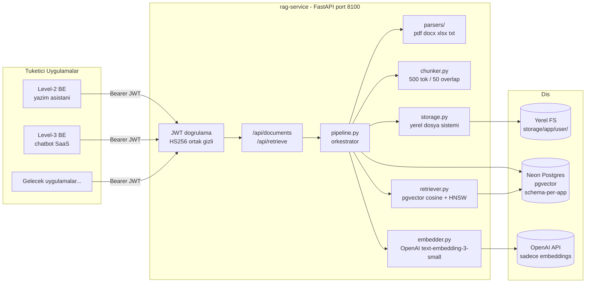
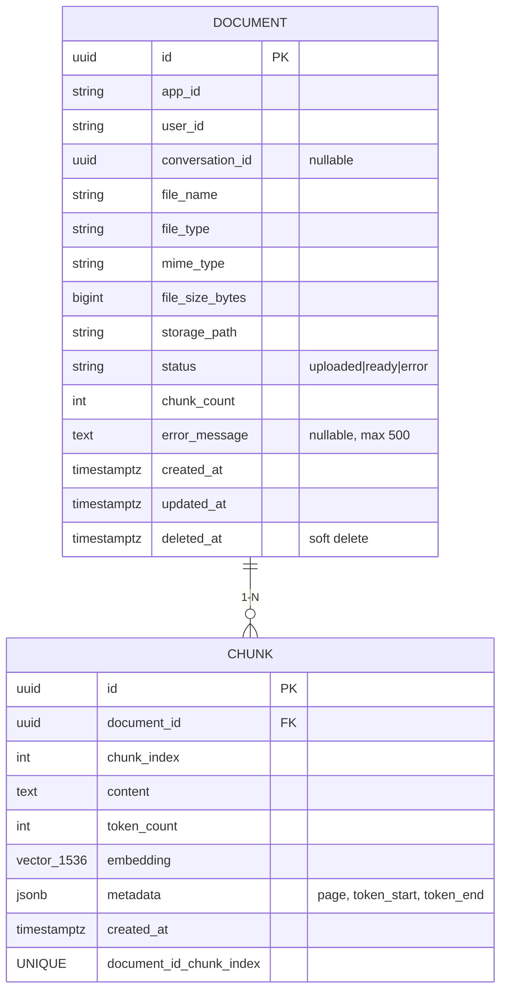

# rag-service — Mimari, Akış ve Kararlar (TR)

> **Durum:** Faz 0–4 tamamlandı. Servis özellik olarak bitti ve
> uçtan uca in-process doğrulandı. Henüz Level-2 BE'ye entegre değil.
> İngilizce versiyon: `ARCHITECTURE-AND-DECISIONS-EN.md`.

---

## 1. Bu servis nedir

`rag-service`, tüm SaaS portföyünün (Level-2 yazım asistanı, Level-3
chatbot, gelecek uygulamalar) Retrieval-Augmented Generation
altyapısının tamamına sahip **bağımsız bir FastAPI mikroservisi**dir.

Yalnızca **dört** iş yapar, başka hiçbir şey yapmaz:

1. Kullanıcının yüklediği dökümanları **alır** (PDF / DOCX / XLSX / TXT).
2. Bunları PostgreSQL + pgvector'da vektör embedding'leri olarak **indeksler**.
3. Bir sorgu için en alakalı **k** parçayı **getirir**.
4. Tenant'ları **izole eder**; uygulama A asla uygulama B'nin verisini göremez.

Bilinçli olarak yapmadığı şeyler:

- LLM çağrısı yapmaz (her tüketici uygulama kendi LLM key + prompt'una sahiptir),
- Konuşma saklamaz,
- Son kullanıcı kimlik doğrulaması yapmaz (sadece backend servislere JWT ile güvenir).

---

## 2. Üst seviye mimari



---

## 3. Adım adım istek akışları

### 3.1 Yükleme + indeksleme — `POST /api/documents`

```mermaid
sequenceDiagram
    autonumber
    participant App as Tuketici BE
    participant Auth as auth.verify_internal_jwt
    participant R as routers/documents.upload
    participant P as pipeline.ingest_document
    participant S as storage.LocalStorage
    participant DB as Postgres sema
    participant Par as parsers
    participant Ch as chunker
    participant Em as embedder
    participant OAI as OpenAI

    App->>Auth: POST multipart + Bearer JWT
    Auth-->>R: InternalIdentity(app_id, user_id, conv_id)
    R->>P: ingest_document(content, filename, mime)
    P->>S: save(content) returns path
    P->>DB: INSERT document status=uploaded + COMMIT
    P->>Par: parse(content, mime) returns ParsedDocument
    P->>Ch: chunk_pages(parsed) returns Chunk list
    P->>Em: embed_batch(texts) returns vectors
    Em->>OAI: POST /v1/embeddings batch=100
    OAI-->>Em: 1536-boyutlu vectors
    P->>DB: toplu INSERT chunks + UPDATE doc status=ready + COMMIT
    P-->>R: document_id
    R->>DB: chunk_count icin doc'u yeniden oku
    R-->>App: 201 document_id status chunk_count
```

**Hata durumunda** (parse / embed / DB yazımı): döküman satırı
`status='error'` ile güncellenir, `error_message` 500 karaktere
kesilir, exception yukarı fırlatılır (HTTP katmanı 500 döner).

### 3.2 Semantik arama — `POST /api/retrieve`

```mermaid
sequenceDiagram
    autonumber
    participant App as Tuketici BE
    participant Auth as JWT dogrulama
    participant R as routers/retrieve
    participant P as pipeline.retrieve_context
    participant Em as embedder
    participant Ret as retriever
    participant DB as Postgres HNSW idx

    App->>Auth: POST query+k+max_distance + JWT
    Auth-->>R: InternalIdentity
    R->>P: retrieve_context(query, k, max_distance)
    P->>Em: embed_one(query) returns vector 1536-d
    P->>Ret: retrieve(vector, app_id, user_id, k, max_distance)
    Ret->>DB: SELECT ORDER BY cosine_dist ASC LIMIT k<br/>WHERE dist &lt;= max_distance<br/>AND app_id, user_id, deleted_at IS NULL
    DB-->>Ret: satirlar
    Ret-->>P: RetrievedChunk listesi
    P-->>R: chunks
    R-->>App: 200 chunks listesi
```

**Halüsinasyon kalkanı:** hiçbir chunk `max_distance` (varsayılan
`0.4`) eşiğini geçemezse, yanıt `{chunks: []}` döner. Tüketici
uygulama o zaman cevap uydurmak yerine "bilgim yok" demesi gerektiğini
bilir.

---

## 4. Çok-tenant izolasyon modeli

Üç katman, hepsi sunucu tarafında zorunlu:

| Katman | Mekanizma |
|--------|-----------|
| Uygulama düzeyi | Her uygulama için ayrı Postgres **şeması**: `rag_level2_writer`, `rag_level3_chatbot`, ... Aynı tablo şekilleri, farklı şemalar. |
| Kullanıcı düzeyi | Her satırda `app_id` + `user_id` kolonu var; her sorgu ikisiyle de filtreleniyor. |
| Konuşma düzeyi (opsiyonel) | Dökümanlar bir `conversation_id` UUID'ye scope'lanabilir. Aynı kullanıcının birden fazla sohbeti olduğunda kullanışlı. |

Tüketici backend kendi `app_id`/`user_id`'sini **belirleyemez** —
her ikisi de kendi mint ettiği JWT'den gelir (gizli içeride paylaşılır,
son kullanıcıya asla görünmez).

---

## 5. Veri modeli (uygulama şeması başına)



Ek olarak şemalar arası `rag_shared.embedding_cache` — uygulamalar
arasında aynı içerik chunk'larını deduplicate eder (OpenAI maliyetini
düşürmek için, ileride doldurulacak).

**İndeksler:**

- `documents (app_id, user_id, deleted_at)` — listeleme
- `documents (conversation_id)` — konuşma scope'u
- `chunks (document_id)` — cascade lookup
- `chunks` üzerinde **HNSW** `embedding vector_cosine_ops` — `m=16,
  ef_construction=64` — gerçek arama indeksi

---

## 6. Anahtar tasarım kararları

| Karar | Gerekçe |
|-------|---------|
| **Mikroservis, kütüphane değil** | Her uygulama kendi stack'inde kalır (Angular+.NET / Python / Node); rag-service sürümlenebilir HTTP kontratıdır. |
| **Schema-per-app** (satır-bazlı multi-tenancy yerine) | Daha ucuz migration, güçlü izolasyon, tek tenant backup/restore edilebilir. |
| **rag-service LLM çağırmaz** | Her uygulama kendi prompt stratejisi, model seçimi ve OpenAI faturasının sahibidir. Sadece embedding merkezi. |
| **HS256 + ortak gizli** (OAuth değil) | Yalnızca servisten-servise. İç ağ. Rotasyonu basit. JWT `app_id` + `user_id` + opsiyonel `conversation_id` taşır. |
| **Blob için yerel dosya sistemi** (Faz 1) | Şu an için S3'ten basit. `StorageBackend` bir Protocol — S3/Azure Blob'a geçiş tek sınıf değişikliği. |
| **tiktoken `cl100k_base` chunker, 500/50** | `text-embedding-3-small`'un kullandığı OpenAI tokenizer ile uyumlu. 500 token ≈ 2-3 paragraf — kesin olacak kadar küçük, bağlam taşıyacak kadar büyük. |
| **Cosine distance + max 0.4** | `text-embedding-3-small` için "gerçekten alakalı" ile "muğlak alakalı"yı ampirik olarak ayırıyor. Halüsinasyon kalkanı. |
| **HNSW (IVFFlat yerine)** | Küçük-orta ölçekte daha iyi recall/latency dengesi, `LISTS` ayarı gerektirmez. |
| **Soft delete** (`deleted_at`) | Geçmiş konuşmalardaki eski alıntılar hala dosya adına çözülür; retrieval bunları atlar. |
| **Bağlantı: Neon pooler + `statement_cache_size=0`** | PgBouncer transaction mode, asyncpg'nin prepared statement cache'ini bozuyor. Zorunlu ayar. |

---

## 7. Modül haritası (`rag_service/`)

| Dosya | Sorumluluk |
|-------|------------|
| `main.py` | FastAPI app, lifespan (boot'ta DB ping), CORS, router mount, `/api/health/{,live,ready}`. |
| `config.py` | Pydantic-settings: `DATABASE_URL`, `OPENAI_API_KEY`, `INTERNAL_JWT_SECRET`, `CORS_ORIGINS`. `@lru_cache` ile singleton. |
| `db.py` | Async SQLAlchemy engine + `session_factory`. Readiness için `ping_db()`. Shutdown'da `dispose_engine()`. |
| `auth.py` | JWT doğrulama (`InternalIdentity` modeli + `AuthedIdentity` FastAPI dependency). |
| `storage.py` | `StorageBackend` Protocol + `LocalStorageBackend`. Path-traversal koruması. Düzen: `{root}/{app_id}/{user_id}/{uuid}-{ad}`. |
| `parsers/` | MIME dispatcher → `pdf_parser`, `docx_parser`, `xlsx_parser`, `txt_parser`. Ortak `ParsedDocument`/`ParsedPage` dataclass'ları. |
| `chunker.py` | `tiktoken` sliding-window splitter. Varsayılan: 500 tok / 50 overlap / min 20. |
| `embedder.py` | `AsyncOpenAI` singleton, `embed_one`, `embed_batch` (size 100, 3 retry, 30 s timeout). |
| `retriever.py` | `embedding.cosine_distance(:q)` ifadesi WHERE + ORDER BY'da tekrar kullanılarak top-k vektör arama. |
| `pipeline.py` | Orkestratör: `ingest_document()` + `retrieve_context()`. Ayrıca `schema_for_app()` + `_APP_TO_SCHEMA` map. |
| `schemas.py` | Pydantic request/response modelleri. |
| `routers/documents.py` | `POST /api/documents`, `GET /api/documents`, `DELETE /api/documents/{id}`. |
| `routers/retrieve.py` | `POST /api/retrieve`. |
| `models/level2.py`, `models/level3.py` | Şema başına SQLAlchemy ORM tabloları. |
| `alembic/` | Şema-farkındalıklı migration: aynı migration her şema için bir kez `MetaData(schema=...)` ile çalışır. |

---

## 8. Public HTTP kontratı

Tüm endpoint'ler şu claim'lere sahip `Authorization: Bearer <HS256-JWT>` gerektirir:

| Claim | Zorunlu | Notlar |
|-------|---------|--------|
| `sub` | evet | `user_id` olur |
| `app_id` | evet | `_APP_TO_SCHEMA` üzerinden map'lenir |
| `exp` | evet | kısa TTL (örn. 5 dk) |
| `iat` | önerilir | |
| `conversation_id` | hayır | UUID, dökümanları tek bir sohbete scope'lar |

| Endpoint | Verb | Status | Body / Query | Döner |
|----------|------|--------|--------------|-------|
| `/api/health/live` | GET | 200 | — | `{status:"alive",...}` |
| `/api/health/ready` | GET | 200 / 503 | — | DB erişilebilirliği |
| `/api/documents` | POST | 201 / 401 / 415 | multipart `file`, opsiyonel `conversation_id` form | `{document_id, status, chunk_count}` |
| `/api/documents` | GET | 200 / 401 | opsiyonel `?conversation_id=` | `{documents: [...]}` |
| `/api/documents/{id}` | DELETE | 204 / 401 / 404 | — | boş body |
| `/api/retrieve` | POST | 200 / 401 | `{query, k=4, max_distance=0.4}` | `{chunks: [...]}` |

Hata modeli: `{"detail": "..."}` (FastAPI varsayılanı).

---

## 9. İleride bilinmesi gerekenler

- **Embedding maliyeti:** `text-embedding-3-small` ile 1M token başına
  ~$0.02. Batch 100 round-trip maliyetini düşük tutar. Paylaşılan
  cache (ileri faz) uygulamalar arası dedup yapacak.
- **Toplu ekleme sonrası HNSW:** büyük importlar için indeksi düşür,
  toplu ekle (~3× hızlı), sonra yeniden indeksle.
- **`max_distance` ayarı:** embedding modelini değiştirirsen distance
  skalası da değişir. Ampirik olarak yeniden ayarla.
- **Şema rotasyonu:** yeni uygulama eklemek = şemayı yarat + `target_schema=<yeni>`
  env var ile Alembic çalıştır + `_APP_TO_SCHEMA`'ya ekle.
- **Gizli rotasyonu:** tüm backend'ler `INTERNAL_JWT_SECRET`'ı
  paylaşır. Hepsini aynı anda döndür (veya overlap penceresini destekle).
- **Storage backend değişimi:** S3 / Azure Blob için `StorageBackend`
  Protocol'unu implement et; pipeline'ın geri kalanı aynı kalır.
- **Neon pooler tuhaflıkları:** asyncpg + PgBouncer transaction mode
  ile `statement_cache_size=0` pazarlık konusu değil. Kaldırırsan her
  sorgu rastgele "prepared statement does not exist" ile patlıyor.

---

## 10. Doğrulanan davranışlar

Uçtan uca ASGI smoke test (Faz 4 çıkış kapısı):

| Senaryo | Sonuç |
|---------|-------|
| `Authorization` header'ı yok | 401 |
| Yanlış JWT imzası | 401 |
| 800-byte `.txt` yükleme | 201, `status=ready`, 1 chunk |
| Kendi dökümanlarını listele | 200, yüklemeyi içeriyor |
| Retrieve HIT ("Almanya'nın başkenti ne?") | 200, 1 chunk, distance 0.3689 |
| Retrieve MISS ("PostgreSQL connection pooling tips") | 200, 0 chunk (kalkan çalışıyor) |
| Soft delete | 204, sonraki list onu hariç tutuyor |

Ayrıca Faz 3 bağımsız testi: 150-kelimelik metin → chunk → embed →
gerçek OpenAI üzerinde semantik olarak doğru cosine distance'larla geri getirildi.

---

## 11. Bu servisin commit geçmişi

| Commit | Faz |
|--------|-----|
| `1d16153 / 6402a9a / f8d8738` | Faz 0 — FastAPI iskelet |
| `1801113` | Faz 1 — Neon DB bağlantısı |
| `fc0db82` | Faz 2 — Alembic + ilk migration |
| `15fb818` | Faz 3.1 — storage + parsers |
| `475b483` | Faz 3.2 + 3.3 — chunker + embedder |
| `1c53ed7` | Faz 3.4 + 3.5 — retriever + pipeline |
| `eeee125` | chore — formatter düzeltmeleri |
| `6ee5ec7` | **Faz 4 — JWT korumalı REST API** |
